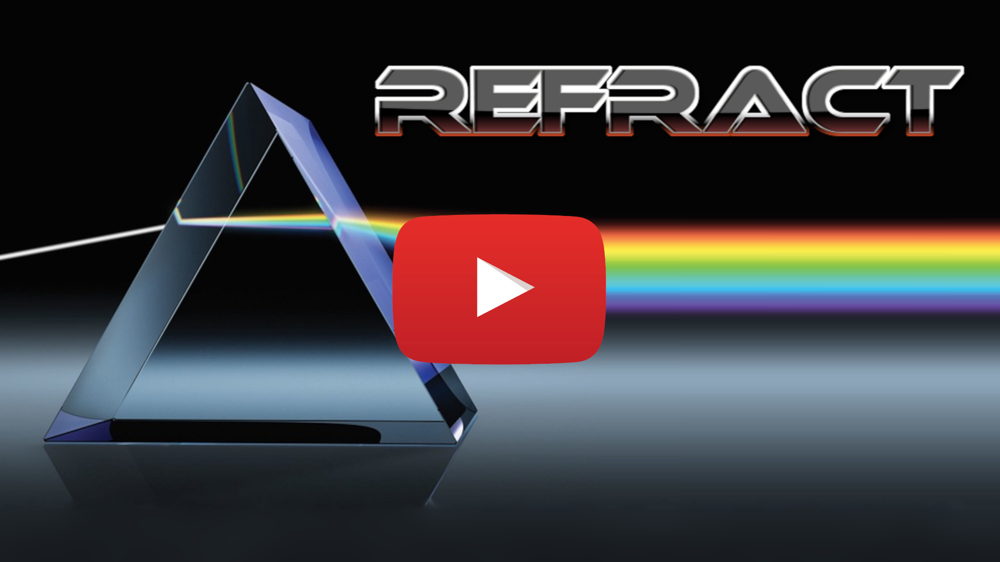
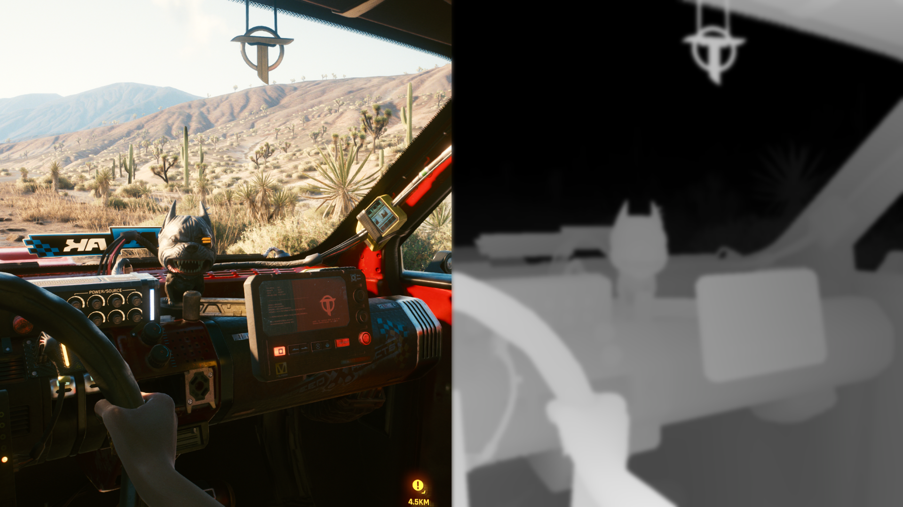
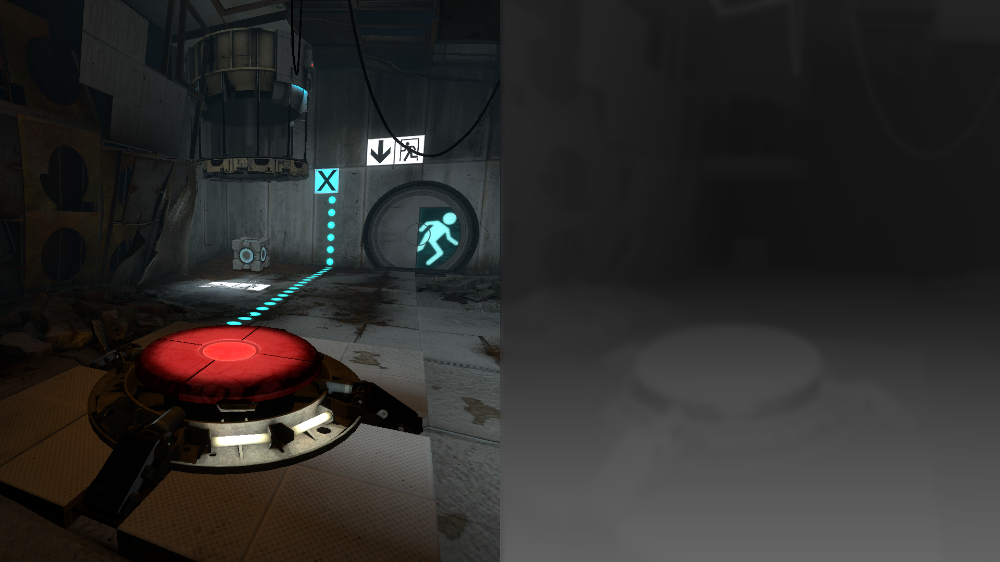
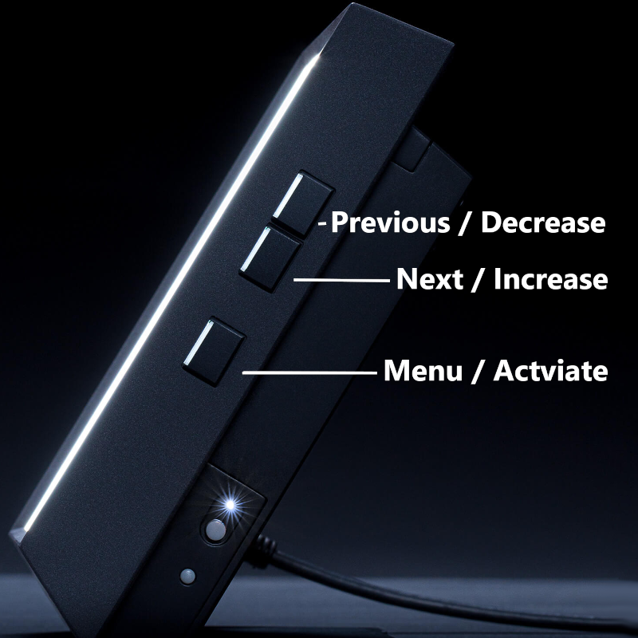

# Refract
**Refract** is a real-time holographic streaming toolkit for [Looking Glass Portrait](https://lookingglassfactory.com/portrait). When combined with [ReGlass][ReGlass], **Refract** allows you to play more than 500 commercial games as holograms on your Portrait.

[Watch the video](https://youtu.be/YKgHC-UgFOY)

## How Does it Work?
Once installed, [ReGlass][ReGlass] draws your game with color on one side and depth on the other. 

 &nbsp; &nbsp; 

This works great for screenshots and video captures, but it doesn't allow you to actually *play* the game on your Portrait. That's where **Refract** comes in.

Refract uses the color and depth information coming from ReGlass to *dynamically generate* a holographic scene with multiple camera angles. The holographic scene is then rendered on the Portrait in real-time.  

## System Requirements
As you can imagine, Refract works best on high-end systems. Refract is essentially running two games at the same time, but I have done what I can to support as many systems as possible. Several settings can be adjusted, and I've included a whole section below on improving performance.

Here are some estimates:

**Nvidia 3080** can run modern games like Cyberpunk at close to 60 FPS without sacrificing hologram quality. Though you'll want to turn off Ray Tracing and lower the resolution.

**Nvidia 1080** can *probably* handle classic games like Portal 2 close to 60 FPS without sacrificing hologram quality.

Going down from there, you'll likely need to turn on **Interpolation** (camera angle skipping) to achieve higher frame rates.       

## Usage
1. Download [ReGlass][ReGlass] and get it fully working with your game. Use the [ReGlass Game Settings][RGGameSettings] page for help with this process.
1. Download the latest [Refract Archive](https://github.com/SolerSoft/Refract/releases/download/v1.1/Refract_1.0.zip) and unzip it.
1. (Optional) create a shortcut to **Refract.exe** on your Start menu or task bar.
1. Launch your game and enable **ReGlass**.
1. Launch **Refract.exe** and Enjoy! 

## Configuration
Refract includes a menu that runs directly on the Portrait itself!

To bring up the menu, press the hardware button on the bottom-right side of the Portrait.

The button at the top-right of the menu is **Close Menu** button:

This simply hides the menu so you can focus on your game.

Next there's the **Show scene while in menu** check box. 

Seeing the game while you're adjusting settings can be helpful, but sometimes it can also be distracting. This box shows or hides the game while you're in the menu.

Next we have four sliders:

- **Depthiness:** This slider controls how deep the scene goes into the display and how far it pops out. While it may be tempting to crank this all the way up, doing so can be hard on the eyes.
 
- **Focus:** Looking Glass displays have one plane of depth that appears more sharp than others. This slider lets you control which depth plane is in focus. If too much of the scene appears out of focus, use the **Depthiness** slider to decrease overall depth and try again.

- **Tessellation:** On each frame, Refract creates a 3D object to match the shape of your game world. This slider controls how much detail goes into that object. In general, this slider should be set as low as possible while still looking good. Setting this slider too high will result in "swimming" each time the object updates.

- **Interpolation:** By default, Refract renders 48 camera angles of your game world. You can think of this slider as skipping camera angles then trying to guess what's missing in between. On fast machines this slider should be all the way to the left. Turning this slider up could significantly improve frame rate, but it could also significantly reduce picture quality.       

And finally there's the Quit button:

 

Activating this button saves your settings and shuts down Refract.

## Improving Performance
By far the most important impact on performance is everything that happens *before* Refract gets involved. This means it's important to make sure your OS, the game itself and ReGlass are all highly optimized before starting Refract.

### OS Optimization

1. I know this goes without saying, but do make sure you have the latest graphics driver installed.
1. Set Windows Desktop to 1920 x 1080. Games that use "Fullscreen Windowed" might render at lower resolutions, but their output is then scaled to desktop resolution. High Desktop resolutions take *significantly* longer to capture, which reduces the total frame rate possible in Refract.
1. Close extra programs running in the background or System Tray. These might consume CPU cycles that Refract could otherwise leverage.  

### Game Optimization

1. Set the game to run at 1920 x 1080. While your machine may be capable of far more than that, we're trying to reserve capacity for Refract to run in the background. Also, since we'll be playing on an 8" display, higher resolutions will have diminishing returns. 
1. Turn VSync and / or Frame Limiting **ON**. Your machine may be capable of 144 FPS but the Portrait is not. Rendering extra frames takes time that Refract could use to run.    
1. If necessary, turn off advanced features like Ray Tracing. Remember: Though your game may be hitting 60 FPS, for Refract it's all about the capacity left over *between* those frames.   

### ReGlass Optimization
The main optimization for ReGlass is to turn on [Performance Mode](https://jbienz.github.io/ReGlass#performance-mode) once everything's configured. This can easily free up 15 - 20 FPS that Refract can use.   

### Refract Optimization
Everything above will have *far* more impact than what's listed here, but these options can help too:

1. Reducing **Tessellation** can help, but reducing it too far will result in a flat image with jaggies.
1. Increasing **Interpolation** will help, but at significant cost to picture quality.

## Questions
*Why "Refract"?*

Wikipedia defines [refraction](https://en.wikipedia.org/wiki/Refraction) as "the change in direction of a wave passing from one medium to another". Since **Refract** redirects light from a 2D display to a holographic one, I thought the name was appropriate.

*Why is [ReGlass][ReGlass] associated with [jbienz][jbienz] but Refract associated with [SolerSoft][SolerSoft]?*

I usually release open source software under my personal github ([jbienz][jbienz]), but since **Refract** includes binary executables I wanted to be a little more careful. SolerSoft is a LLC I created years ago exactly for this purpose. Still, note that none of my open source projects include any kind of warranty. Use at your own risk. ;)

## About the Author
Jared Bienz 
 
[jbienz](https://www.linkedin.com/in/jbienz) &nbsp; [Road to MR](https://www.roadtomr.com) &nbsp; [Blog](https://jared.bienz.com) &nbsp; [@jbienz](https://twitter.com/jbienz)

I'm not always online, but my user name is **eXntrc** on the [Looking Glass Discord](https://discord.com/invite/lookingglassfactory).

**No Express or Implied Warranty.** This software is provided "as is", with all faults. There are no warranties or guarantees, express or implied.

[ReGlass]: https://jbienz.github.io/ReGlass "ReGlass Home Page"
[RGGameSettings]: https://jbienz.github.io/ReGlass/GameSettings.html "ReGlass Game Setting"
[jbienz]: https://github.com/jbienz "JBienz on GitHub"
[SolerSoft]: https://github.com/SolerSoft "SolerSoft on GitHub"